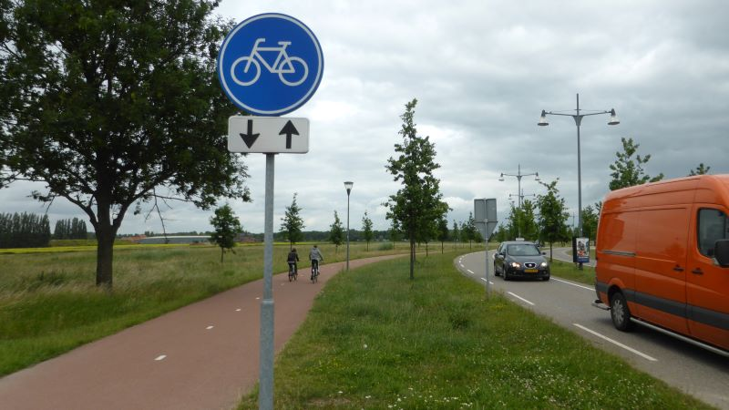
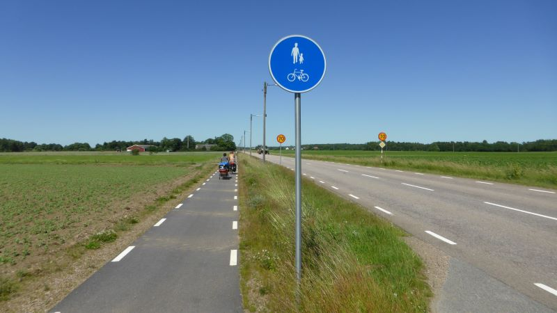
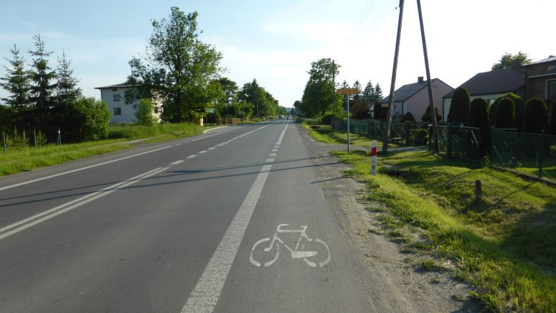
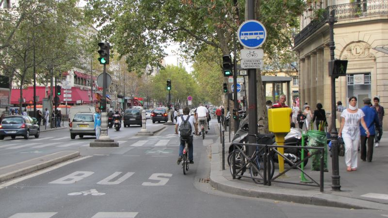
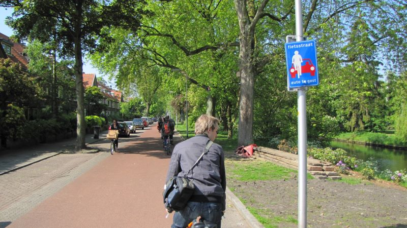
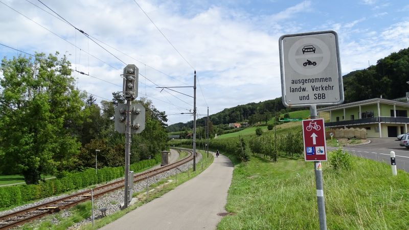
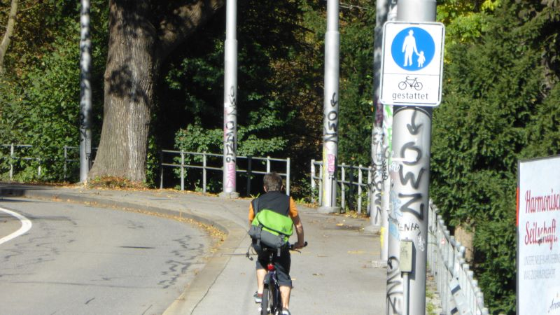

| Infrastructure type | Description | Example |
| --- | --- | --- |
| Cycle track | An independent road or part of a road designated for cycles, signposted as such. Cyclists are physically separated from motorised traffic, for example by a dividing verge, a kerb or a safety barrier. |  |
| Cycle and pedestrian track | As above, but the same space is shared with pedestrians. |   |
| Cycle lane | A part of a carriageway designated for cycles. Distinguished from the rest of the carriageway by paint only. |  |
| Bus and cycle lane | A lane reserved for (public transport) buses and cycles. |  |
| Cycle street | A road where (some) motorised traffic is allowed, but cycle traffic is prioritised on the carriageway. Signage and exact rules vary across countries. |  |  
| Limited access road | A road where motorised traffic is limited (for example, only agricultural vehicles or vehicles of the residents are allowed), but fully open to cycles (but, contrary to cycle street, cyclists are not indicated as priority users). |  | 
| Pedestrian track with cycling allowed | A road or a part of the road originally designed for pedestrians, where cycling has been (conditionally) authorised, either by general rules or through a cycle panel under the pedestrian track sign. *Not included in the dashboard as for now.* |  |
