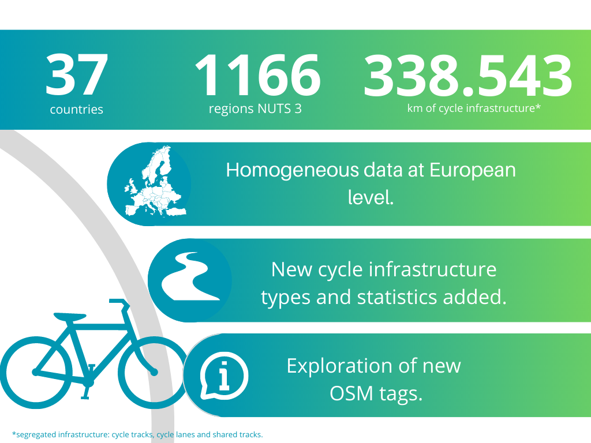

# Quantifying Europe’s Cycling Infrastructure using OpenStreetMap (QECIO) 

There is a great demand for data on cycling infrastructure, but as for now, no official source provides this kind of information on a European scale. This data project responds to this need by extracting data about cycling infrastructure from OpenStreetMap (OSM). We generalised the methodology to cover most of Europe, took into account additional infrastructure types and provided additional statistics.

This project correspond to second edition of Quantifying Europe's Cycling Infrastructure using Open Street Map (QECIO 2.0.), to access the results from the previous edition click [here](https://datastudio.google.com/u/0/reporting/81d2904d-7db5-4ed5-98e0-85af75b46577/page/p_qsvwe0yluc).

Do not forget to visit our [ECF website](https://ecf.com/). 

# Overview 

#  Shortcuts
- [Ratio of segregated cycle infrastructure to main roads](#Ratio-of-segregated-cycle-infrastructure-to-main-roads)
- [Ratio of cycle infrastructure to all public roads](#Ratio-of-cycle-infrastructure-to-all-public-roads)
- [Cycle tracks surfaces](#Cycle-tracks-surfaces)
- [Aditional data](#Aditional-data)
- [Contraflow cycling](#Contraflow-cycling)

## Ratio of segregated cycle infrastructure to main roads

> **Definition**
> 
The ratio of segregated cycle infrastructure to main roads, is an indicator of road coverage by cycle infrastructure. The segregated cycle infrastructures considered are: cycle tracks, shared pedestrians paths (cycle and pedestrian paths) and cycle lanes. While the road newtork was calculated by integrating highways labeled as motorway, trunk, primary, secondary, tertiary, motorway link, trunk link, primary link, secondary link, tertiary link in OSM. Please visit our methodology section to obtain more insights on the data processing. 

 

The barchart ilustrates the top 20 countries with highest ratios of segregated cycle infrastructure to main roads. Each color represent the share of different infrastructure types. By hovering the mouse, aditional information is displayed.  
 

<iframe src="https://european-cyclists-federation.github.io/Images/Ratio Segregated Cycle Infrastructure.html" height="500" width="800" name="iframe_a" title="Iframe Example"></iframe>
 

The [map](Visualization/Europe_map_A1.html) is coloured to represent the magnitude of the metric of interest. By hovering the mouse over the area of interest the tooltip will display the main metrics. Similarly, the sirze of the dots are proportional to the cycle infrastructure. By clicking on the circles, a bar plot with the types of analyzed infrastructure types will be displayed along with a link to explore the details.
  
 
<iframe src="Visualization/Europe_map_A1.html" height="800" width="800" name="iframe_a" title="Iframe Example"></iframe>
 

If you want to visualize the maps at country level in full screen, please clic in the following links.
 

[AL](Visualization/AL/AL_map_A1.html)
 | 
[AT](Visualization/AT/AT_map_A1.html)
 | 
[BE](Visualization/BE/BE_map_A1.html)
 | 
[BG](Visualization/BG/BG_map_A1.html)
 | 
[CH](Visualization/CH/CH_map_A1.html)
 | 
[CY](Visualization/CY/CY_map_A1.html)
 | 
[CZ](Visualization/CZ/CZ_map_A1.html)
 |
[DE](Visualization/DE/DE_map_A1.html)
 |
[DK](Visualization/DK/DK_map_A1.html)
 |
[EE](Visualization/EE/EE_map_A1.html)
 |
[EL](Visualization/EL/EL_map_A1.html)
 |
[ES](Visualization/ES/ES_map_A1.html)
 |
[FI](Visualization/FI/FI_map_A1.html)
 |
[FR](Visualization/FR/FR_map_A1.html)
 |
[HR](Visualization/HR/HR_map_A1.html)
 |
[HU](Visualization/HU/HU_map_A1.html)
 |
[IE](Visualization/IE/IE_map_A1.html)
 |
[IS](Visualization/IS/IS_map_A1.html)
 |
[IT](Visualization/IT/IT_map_A1.html)
 |
[LI](Visualization/LI/LI_map_A1.html)
 |
[LT](Visualization/LT/LT_map_A1.html)
 |
[LU](Visualization/LU/LU_map_A1.html)
 |
[LV](Visualization/LV/LV_map_A1.html)
 |
[ME](Visualization/ME/ME_map_A1.html)
 |
[MK](Visualization/MK/MK_map_A1.html)
 |
[MT](Visualization/MT/MT_map_A1.html)
 |
[NL](Visualization/NL/NL_map_A1.html)
 |
[NO](Visualization/NO/NO_map_A1.html)
 |
[PL](Visualization/PL/PL_map_A1.html)
 |
[PT](Visualization/PT/PT_map_A1.html)
 |
[RO](Visualization/RO/RO_map_A1.html)
 |
[RS](Visualization/RS/RS_map_A1.html)
 |
[SE](Visualization/SE/SE_map_A1.html)
 |
[SI](Visualization/SI/SI_map_A1.html)
 |
[SK](Visualization/SK/SK_map_A1.html)
 |
[TR](Visualization/TR/TR_map_A1.html)
 |
[UK](Visualization/UK/UK_map_A1.html)
 |
 

 <b>NOTE</b> 
Interested in the spatial data to explore results?. The cyclenetworks are available in GeoPackages format, and can be accessed in the cyclenetworks folders </a>
in the <a href="https://european-cyclists-federation.github.io/another-page.html"> Metadata page </a> .

 

## Ratio of cycle infrastructure to all public roads

> **Definition**
> 
 The ratio of cycle infrastructure to public roads, is an indicator of road coverage by cycle infrastructure. The extended cycle infrastructure used in the numerator considered: cycle tracks, shared tracks (cycle and pedestrian paths), cycle lanes, limited access roads, bus lanes and cycle streets. While the length of the road network used in the denominator was calculated by adding main roads plus local roads . The local roads were selected from roads tagged as: residential, living street, unclassified.  Please visit our methodology section to obtain more insights on the data processing. 

 

The barchart ilustrates the top 20 countries with highest ratios of cycle infrastructure to all public roads. Each color represent the share of different infrastructure types. By hovering the mouse, aditional information is displayed.  
 

<iframe src= "Images/Ratio extended cycle infrastructure over public roads.html" height="500" width="800" name="iframe_a" title="Iframe Example"></iframe>
 

The [map](Visualization/Europe_map_A2.html) is coloured to represent the magnitude of the metric of interest. By hovering the mouse over the area of interest the tooltip will display the main metrics. Similarly, the size of the dots is proportional to the total  cycle infrastructure. By clicking in the circles, a bar plot with the types of infrastructure will be displayed along with a link to explore the details.
 

<iframe src="Visualization/Europe_map_A2.html" height="800" width="800" name="iframe_a" title="Iframe Example"></iframe>

If you want to visualize the maps at country level in full screen, please clic in the following links.
 

[AL](Visualization/AL/AL_map_A2.html)
 | 
[AT](Visualization/AT/AT_map_A2.html)
 |
[BE](Visualization/BE/BE_map_A2.html)
 |
[BG](Visualization/BG/BG_map_A2.html)
 |
[CH](Visualization/CH/CH_map_A2.html)
 |
[CY](Visualization/CY/CY_map_A2.html)
 |
[CZ](Visualization/CZ/CZ_map_A2.html)
 |
[DE](Visualization/DE/DE_map_A2.html)
 |
[DK](Visualization/DK/DK_map_A2.html)
 |
[EE](Visualization/EE/EE_map_A2.html)
 |
[EL](Visualization/EL/EL_map_A2.html)
 |
[ES](Visualization/ES/ES_map_A2.html)
 |
[FI](Visualization/FI/FI_map_A2.html)
 |
[FR](Visualization/FR/FR_map_A2.html)
 |
[HR](Visualization/HR/HR_map_A2.html)
 |
[HU](Visualization/HU/HU_map_A2.html)
 |
[IE](Visualization/IE/IE_map_A2.html)
 |
[IS](Visualization/IS/IS_map_A2.html)
 |
[IT](Visualization/IT/IT_map_A2.html)
 |
[LI](Visualization/LI/LI_map_A2.html)
 |
[LT](Visualization/LT/LT_map_A2.html)
 |
[LU](Visualization/LU/LU_map_A2.html)
 |
[LV](Visualization/LV/LV_map_A2.html)
 |
[ME](Visualization/ME/ME_map_A2.html)
 |
[MK](Visualization/MK/MK_map_A2.html)
 |
[MT](Visualization/MT/MT_map_A2.html)
 |
[NL](Visualization/NL/NL_map_A2.html)
 |
[NO](Visualization/NO/NO_map_A2.html)
 |
[PL](Visualization/PL/PL_map_A2.html)
 |
[PT](Visualization/PT/PT_map_A2.html)
 |
[RO](Visualization/RO/RO_map_A2.html)
 |
[RS](Visualization/RS/RS_map_A2.html)
 |
[SE](Visualization/SE/SE_map_A2.html)
 |
[SI](Visualization/SI/SI_map_A2.html)
 |
[SK](Visualization/SK/SK_map_A2.html)
 |
[TR](Visualization/TR/TR_map_A2.html)
 |
[UK](Visualization/UK/UK_map_A2.html)

 <b>NOTE</b> 
Interested in the spatial data to explore results?. The cyclenetworks are available in GeoPackages format, and can be accessed in the cyclenetworks folders </a>
in the <a href="https://european-cyclists-federation.github.io/another-page.html"> Metadata page </a> .

 |
##  Cycle tracks surfaces

  > **Definition**
> 
 The ratio of cycle tracks to main roads, is an indicator of road coverage by cycle infrastructure. Only cycle tracks length was used in the numerator. While the road network used in the denominator was calculated by adding main roads. The different types of surfaces were grouped according to European Certification Standard (ECS) criteria. Please visit our methodology section to obtain more insights on the data processing.

 

The left barchart ilustrates the top 20 countries with highest ratios of cycle tracks over main roads. The right barchart ilustrates the share of surface type found in the cycle tracks.  Each color represent the share of different infrastructure types. By hovering the mouse, aditional information is displayed.  
 

<iframe src="Images/Cycle tracks ratio and surface.html" height="500" width="800" name="iframe_a" title="Iframe Example"></iframe>
 

The [map](Visualization/Europe_map_B.html) presents the ratio of cycle tracks over the main roads.  The map is coloured to represent the magnitude of the metric of interest. By hovering the mouse over the area of interest the tooltip will display the main metrics. Similarly, the size of the dots is proportional to the cycle tracks infrastructure. By clicking on the circles, a bar plot with the surface types will be displayed along with a link to explore the details.
 

<iframe src="Visualization/Europe_map_B.html" height="800" width="800" name="iframe_a" title="Iframe Example"></iframe>
 

If you dessire to access a more detailed map per country please click in any of the following links:

[AL](Visualization/AL/AL_map_B.html)
 | 
[AT](Visualization/AT/AT_map_B.html)
 |
[BE](Visualization/BE/BE_map_B.html)
 |
[BG](Visualization/BG/BG_map_B.html)
 |
[CH](Visualization/CH/CH_map_B.html)
 |
[CY](Visualization/CY/CY_map_B.html)
 |
[CZ](Visualization/CZ/CZ_map_B.html)
 |
[DE](Visualization/DE/DE_map_B.html)
 |
[DK](Visualization/DK/DK_map_B.html)
 |
[EE](Visualization/EE/EE_map_B.html)
 |
[EL](Visualization/EL/EL_map_B.html)
 |
[ES](Visualization/ES/ES_map_B.html)
|
[FI](Visualization/FI/FI_map_B.html)
 |
[FR](Visualization/FR/FR_map_B.html)
 |
[HR](Visualization/HR/HR_map_B.html)
 |
[HU](Visualization/HU/HU_map_B.html)
 |
[IE](Visualization/IE/IE_map_B.html)
 |
[IS](Visualization/IS/IS_map_B.html)
 |
[IT](Visualization/IT/IT_map_B.html)
 |
[LI](Visualization/LI/LI_map_B.html)
 |
[LT](Visualization/LT/LT_map_B.html)
 |
[LU](Visualization/LU/LU_map_B.html)
 |
[LV](Visualization/LV/LV_map_B.html)
 |
[ME](Visualization/ME/ME_map_B.html)
 |
[MK](Visualization/MK/MK_map_B.html)
 |
[MT](Visualization/MT/MT_map_B.html)
 |
[NL](Visualization/NL/NL_map_B.html)
 |
[NO](Visualization/NO/NO_map_B.html)
 |
[PL](Visualization/PL/PL_map_B.html)
 |
[PT](Visualization/PT/PT_map_B.html)
 |
[RO](Visualization/RO/RO_map_B.html)
 |
[RS](Visualization/RS/RS_map_B.html)
 |
[SE](Visualization/SE/SE_map_B.html)
 |
[SI](Visualization/SI/SI_map_B.html)
 |
[SK](Visualization/SK/SK_map_B.html)
 |
[TR](Visualization/TR/TR_map_B.html)
 |
[UK](Visualization/UK/UK_map_B.html)

## Aditional data

  > **Definition**
> 
 The % of aditional data, is an indicator of completeness of OSM tags. We analyzed how many cycle tracks, shared tracks, cycle lanes and limited access roads were tagged with either surface, smoothnes and width information. The numerator includes the average of roads length that include surface, smoothness and width tag. Please visit our methodology section to obtain more insights on the data processing. 

 

The barchart ilustrates the top 20 countries with highest completeness of OSM tags in the infrastructure analyzed. By hovering the mouse, aditional information is displayed.  
 
<iframe src="Images/Aditional data.html" height="500" width="800" name="iframe_a" title="Iframe Example"></iframe>
 

The [map](Visualization/Europe_map_C.html) presents the shared amount of aditional data from OSM. Areas are coloured in line with the average share of these tags in all cycle infrastructure in the area, and by hovering mouse over a specific area you can find out the detailed statistics for this area. In adition, if you click on the points, a barchart with the share of tags in a certain area is displayed.
 

<iframe src="Visualization/Europe_map_C.html" height="800" width="800" name="iframe_a" title="Iframe Example"></iframe>
 

[AL](Visualization/AL/AL_map_C.html)
 | 
[AT](Visualization/AT/AT_map_C.html)
 |
[BE](Visualization/BE/BE_map_C.html)
 |
[BG](Visualization/BG/BG_map_C.html)
 |
[CH](Visualization/CH/CH_map_C.html)
 |
[CY](Visualization/CY/CY_map_C.html)
 |
[CZ](Visualization/CZ/CZ_map_C.html)
 |
[DE](Visualization/DE/DE_map_C.html)
 |
[DK](Visualization/DK/DK_map_C.html)
 |
[EE](Visualization/EE/EE_map_C.html)
 |
[EL](Visualization/EL/EL_map_C.html)
 |
[ES](Visualization/ES/ES_map_C.html)
 |
[FI](Visualization/FI/FI_map_C.html)
 |
[FR](Visualization/FR/FR_map_C.html)
 |
[HR](Visualization/HR/HR_map_C.html)
 |
[HU](Visualization/HU/HU_map_C.html)
 |
[IE](Visualization/IE/IE_map_C.html)
 |
[IS](Visualization/IS/IS_map_C.html)
 |
[IT](Visualization/IT/IT_map_C.html)
 |
[LI](Visualization/LI/LI_map_C.html)
 |
[LT](Visualization/LT/LT_map_C.html)
 |
[LU](Visualization/LU/LU_map_C.html)
 |
[LV](Visualization/LV/LV_map_C.html)
 |
[ME](Visualization/ME/ME_map_C.html)
 |
[MK](Visualization/MK/MK_map_C.html)
 |
[MT](Visualization/MT/MT_map_C.html)
 |
[NL](Visualization/NL/NL_map_C.html)
 |
[NO](Visualization/NO/NO_map_C.html)
 |
[PL](Visualization/PL/PL_map_C.html)
 |
[PT](Visualization/PT/PT_map_C.html)
 |
[RO](Visualization/RO/RO_map_C.html)
 |
[RS](Visualization/RS/RS_map_C.html)
 |
[SE](Visualization/SE/SE_map_C.html)
 |
[SI](Visualization/SI/SI_map_C.html)
 |
[SK](Visualization/SK/SK_map_C.html)
 |
[TR](Visualization/TR/TR_map_C.html)
 |
[UK](Visualization/UK/UK_map_C.html)
 

##  Contraflow cycling

  > **Definition**
> 
 The contraflow cycling, is a ratio of local one-way streets with contraflow cycling allowed to the total length of local one-way streets. Please visit our methodology section to obtain more insights on the data processing.  

 

The barchart ilustrates the top 20 countries with highest ration of contraflow cycling. By hovering the mouse, aditional information is displayed.  
 
<iframe src= "Images/Ratio Contraflow.html" height="500" width="700" name="iframe_a" title="Iframe Example"></iframe>
 

The [map](Visualization/Europe_map_D.html) presents the ratio of local one-way streets with contraflow cycling allowed to the total length of local one-way streets. Areas are coloured in line with the ranging values of the ratio.  
 

<iframe src="Visualization/Europe_map_D.html" height="800" width="800" name="iframe_a" title="Iframe Example"></iframe>
 
*** Interested in the spatial data used to construct the maps?. The available GeoPackages of the local road networks can be sent upon request to the [authors](#Authors).***
 
If you want to visualize the maps at country level in full screen, please clic in the following links.
 

[AL](Visualization/AL/AL_map_D.html)
 | 
[AT](Visualization/AT/AT_map_D.html)
 |
[BE](Visualization/BE/BE_map_D.html)
 |
[BG](Visualization/BG/BG_map_D.html)
 |
[CH](Visualization/CH/CH_map_D.html)
 |
[CY](Visualization/CY/CY_map_D.html)
 |
[CZ](Visualization/CZ/CZ_map_D.html)
 |
[DE](Visualization/DE/DE_map_D.html)
 |
[DK](Visualization/DK/DK_map_D.html)
 |
[EE](Visualization/EE/EE_map_D.html)
 |
[EL](Visualization/EL/EL_map_D.html)
 |
[ES](Visualization/ES/ES_map_D.html)
 |
[FI](Visualization/FI/FI_map_D.html)
 |
[FR](Visualization/FR/FR_map_D.html)
 |
[HR](Visualization/HR/HR_map_D.html)
 |
[HU](Visualization/HU/HU_map_D.html)
 |
[IE](Visualization/IE/IE_map_D.html)
 |
[IS](Visualization/IS/IS_map_D.html)
 |
[IT](Visualization/IT/IT_map_D.html)
 |
[LI](Visualization/LI/LI_map_D.html)
 |
[LT](Visualization/LT/LT_map_D.html)
 |
[LU](Visualization/LU/LU_map_D.html)
 |
[LV](Visualization/LV/LV_map_D.html)
 |
[ME](Visualization/ME/ME_map_D.html)
 |
[MK](Visualization/MK/MK_map_D.html)
 |
[MT](Visualization/MT/MT_map_D.html)
 |
[NL](Visualization/NL/NL_map_D.html)
 |
[NO](Visualization/NO/NO_map_D.html)
 |
[PL](Visualization/PL/PL_map_D.html)
 |
[PT](Visualization/PT/PT_map_D.html)
 |
[RO](Visualization/RO/RO_map_D.html)
 |
[RS](Visualization/RS/RS_map_D.html)
 | 
[SE](Visualization/SE/SE_map_D.html)
 |
[SI](Visualization/SI/SI_map_D.html)
 |
[SK](Visualization/SK/SK_map_D.html)
 |
[TR](Visualization/TR/TR_map_D.html)
 |
[UK](Visualization/UK/UK_map_D.html)
  

 <b>NOTE</b> 
Interested in the spatial data to explore results?. The cyclenetworks are available in GeoPackages format, and can be accessed in the cyclenetworks folders </a>
in the <a href="https://european-cyclists-federation.github.io/another-page.html"> Metadata page </a> .

 
## Metadata 

[Metadata](https://european-cyclists-federation.github.io/another-page.html)

# The Methodology

The methodology can be accesed through this [link](Documents/QECIO 2 methodology.pdf)

# Built With

  - [GitHub Pages](https://www.contributor-covenant.org/) 

# Authors

  - **Aleksander Buczyński** - [a.buczynski@ecf.com](a.buczynski@ecf.com)
  - **Andrea Chavez-Pacheco**- [a.chavez@ecf.com](a.chavez@ecf.com)

with the kind support of [Agilitic](https://www.agilytic.be/)

